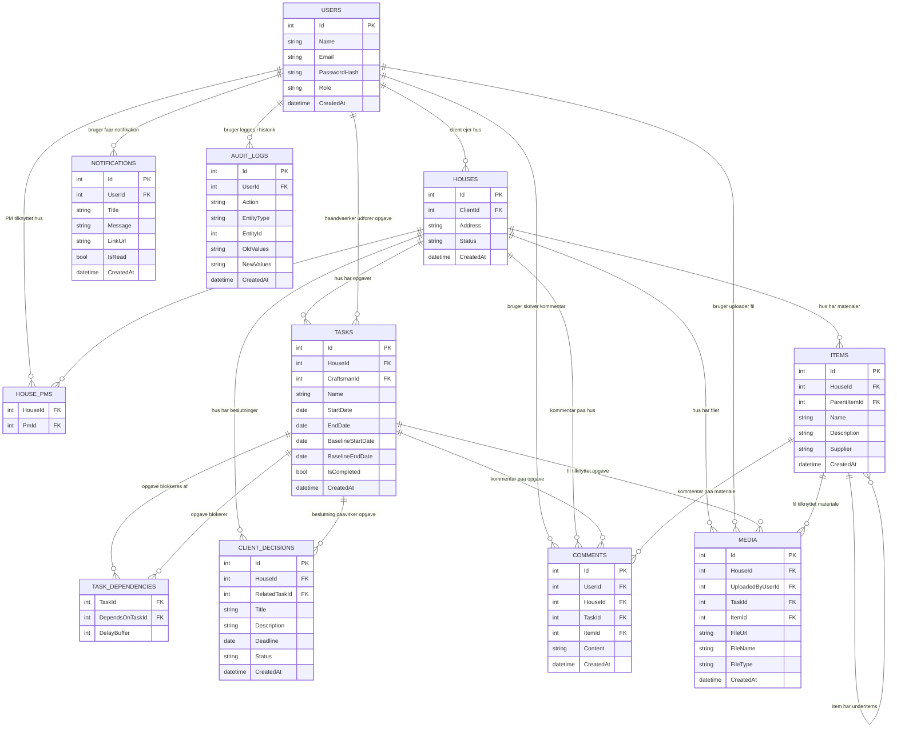

```mermaid
erDiagram

    USERS {
        int Id PK
        string Name
        string Email
        string PasswordHash
        string Role
        datetime CreatedAt
    }

    HOUSES {
        int Id PK
        int ClientId FK
        string Address
        string Status
        datetime CreatedAt
    }

    HOUSE_PMS {
        int HouseId FK
        int PmId FK
    }

    TASKS {
        int Id PK
        int HouseId FK
        int CraftsmanId FK
        string Name
        date StartDate
        date EndDate
        date BaselineStartDate
        date BaselineEndDate
        bool IsCompleted
        datetime CreatedAt
    }

    TASK_DEPENDENCIES {
        int TaskId FK
        int DependsOnTaskId FK
        int DelayBuffer
    }

    CLIENT_DECISIONS {
        int Id PK
        int HouseId FK
        int RelatedTaskId FK
        string Title
        string Description
        date Deadline
        string Status
        datetime CreatedAt
    }

    ITEMS {
        int Id PK
        int HouseId FK
        int ParentItemId FK
        string Name
        string Description
        string Supplier
        datetime CreatedAt
    }

    COMMENTS {
        int Id PK
        int UserId FK
        int HouseId FK
        int TaskId FK
        int ItemId FK
        string Content
        datetime CreatedAt
    }

    MEDIA {
        int Id PK
        int HouseId FK
        int UploadedByUserId FK
        int TaskId FK
        int ItemId FK
        string FileUrl
        string FileName
        string FileType
        datetime CreatedAt
    }

    NOTIFICATIONS {
        int Id PK
        int UserId FK
        string Title
        string Message
        string LinkUrl
        bool IsRead
        datetime CreatedAt
    }

    AUDIT_LOGS {
        int Id PK
        int UserId FK
        string Action
        string EntityType
        int EntityId
        string OldValues
        string NewValues
        datetime CreatedAt
    }

    %% Brugere og huse
    USERS ||--o{ HOUSES : "client ejer hus"
    USERS ||--o{ HOUSE_PMS : "PM tilknyttet hus"
    HOUSES ||--o{ HOUSE_PMS : "hus har PM"

    %% Opgaver
    HOUSES ||--o{ TASKS : "hus har opgaver"
    USERS ||--o{ TASKS : "haandvaerker udforer opgave"
    TASKS ||--o{ TASK_DEPENDENCIES : "opgave blokkeres af"
    TASKS ||--o{ TASK_DEPENDENCIES : "opgave blokerer"

    %% Kundebeslutninger
    HOUSES ||--o{ CLIENT_DECISIONS : "hus har beslutninger"
    TASKS ||--o{ CLIENT_DECISIONS : "beslutning paavirker opgave"

    %% Materialer og items
    HOUSES ||--o{ ITEMS : "hus har materialer"
    ITEMS ||--o{ ITEMS : "item har underitems"

    %% Kommentarer
    USERS ||--o{ COMMENTS : "bruger skriver kommentar"
    HOUSES ||--o{ COMMENTS : "kommentar paa hus"
    TASKS ||--o{ COMMENTS : "kommentar paa opgave"
    ITEMS ||--o{ COMMENTS : "kommentar paa materiale"

    %% Filer og billeder
    HOUSES ||--o{ MEDIA : "hus har filer"
    USERS ||--o{ MEDIA : "bruger uploader fil"
    TASKS ||--o{ MEDIA : "fil tilknyttet opgave"
    ITEMS ||--o{ MEDIA : "fil tilknyttet materiale"

    %% Notifikationer og log
    USERS ||--o{ NOTIFICATIONS : "bruger faar notifikation"
    USERS ||--o{ AUDIT_LOGS : "bruger logges i historik"
```
