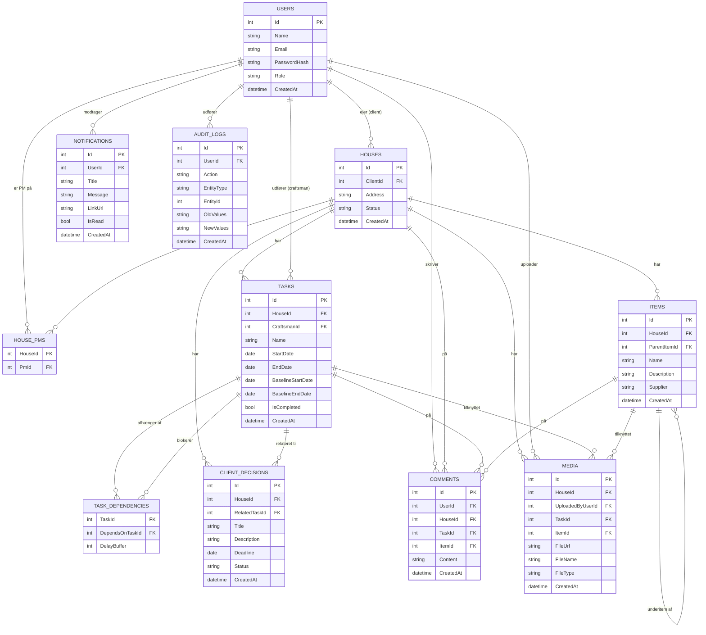

```mermaid
erDiagram

    USERS {
        int Id PK
        string Name
        string Email
        string PasswordHash
        string Role
        datetime CreatedAt
    }

    HOUSES {
        int Id PK
        int ClientId FK
        string Address
        string Status
        datetime CreatedAt
    }

    HOUSE_PMS {
        int HouseId FK
        int PmId FK
    }

    TASKS {
        int Id PK
        int HouseId FK
        int CraftsmanId FK
        string Name
        date StartDate
        date EndDate
        date BaselineStartDate
        date BaselineEndDate
        bool IsCompleted
        datetime CreatedAt
    }

    TASK_DEPENDENCIES {
        int TaskId FK
        int DependsOnTaskId FK
        int DelayBuffer
    }

    CLIENT_DECISIONS {
        int Id PK
        int HouseId FK
        int RelatedTaskId FK
        string Title
        string Description
        date Deadline
        string Status
        datetime CreatedAt
    }

    ITEMS {
        int Id PK
        int HouseId FK
        int ParentItemId FK
        string Name
        string Description
        string Supplier
        datetime CreatedAt
    }

    COMMENTS {
        int Id PK
        int UserId FK
        int HouseId FK
        int TaskId FK
        int ItemId FK
        string Content
        datetime CreatedAt
    }

    MEDIA {
        int Id PK
        int HouseId FK
        int UploadedByUserId FK
        int TaskId FK
        int ItemId FK
        string FileUrl
        string FileName
        string FileType
        datetime CreatedAt
    }

    NOTIFICATIONS {
        int Id PK
        int UserId FK
        string Title
        string Message
        string LinkUrl
        bool IsRead
        datetime CreatedAt
    }

    AUDIT_LOGS {
        int Id PK
        int UserId FK
        string Action
        string EntityType
        int EntityId
        string OldValues
        string NewValues
        datetime CreatedAt
    }

    %% Brugere og huse
    USERS ||--o{ HOUSES : "ejer (client)"
    USERS ||--o{ HOUSE_PMS : "er PM på"
    HOUSES ||--o{ HOUSE_PMS : "har PM"

    %% Opgaver
    HOUSES ||--o{ TASKS : "har"
    USERS ||--o{ TASKS : "udfører (craftsman)"
    TASKS ||--o{ TASK_DEPENDENCIES : "afhænger af"
    TASKS ||--o{ TASK_DEPENDENCIES : "blokerer"

    %% Kundebeslutninger
    HOUSES ||--o{ CLIENT_DECISIONS : "har"
    TASKS ||--o{ CLIENT_DECISIONS : "relateret til"

    %% Materialer og items
    HOUSES ||--o{ ITEMS : "har"
    ITEMS ||--o{ ITEMS : "underitem af"

    %% Kommentarer
    USERS ||--o{ COMMENTS : "skriver"
    HOUSES ||--o{ COMMENTS : "på"
    TASKS ||--o{ COMMENTS : "på"
    ITEMS ||--o{ COMMENTS : "på"

    %% Filer og billeder
    HOUSES ||--o{ MEDIA : "har"
    USERS ||--o{ MEDIA : "uploader"
    TASKS ||--o{ MEDIA : "tilknyttet"
    ITEMS ||--o{ MEDIA : "tilknyttet"

    %% Notifikationer og log
    USERS ||--o{ NOTIFICATIONS : "modtager"
    USERS ||--o{ AUDIT_LOGS : "udfører"
```
